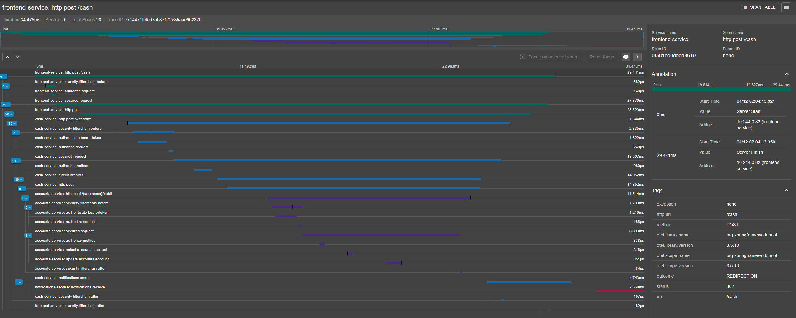
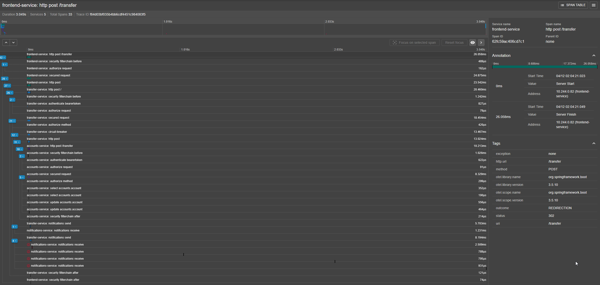
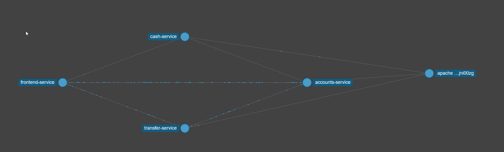
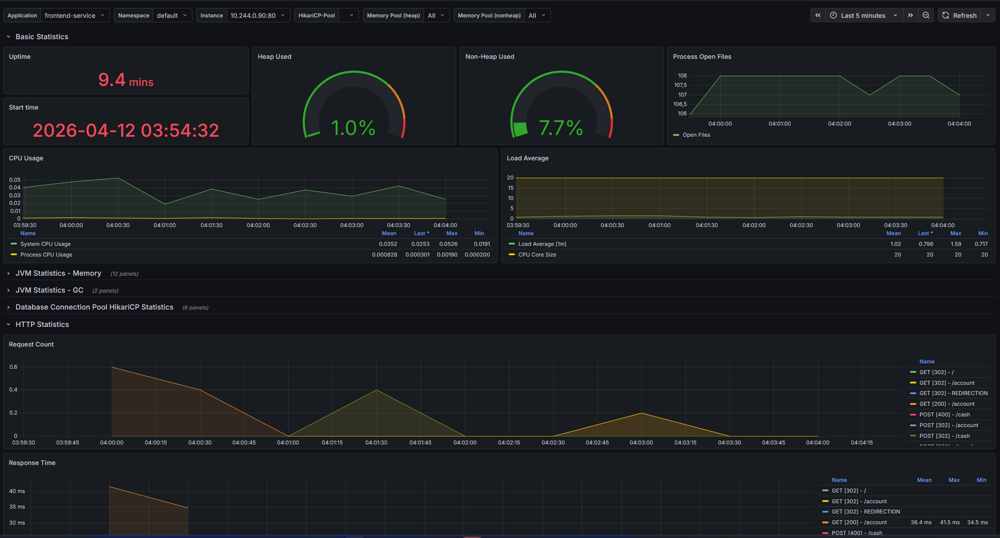
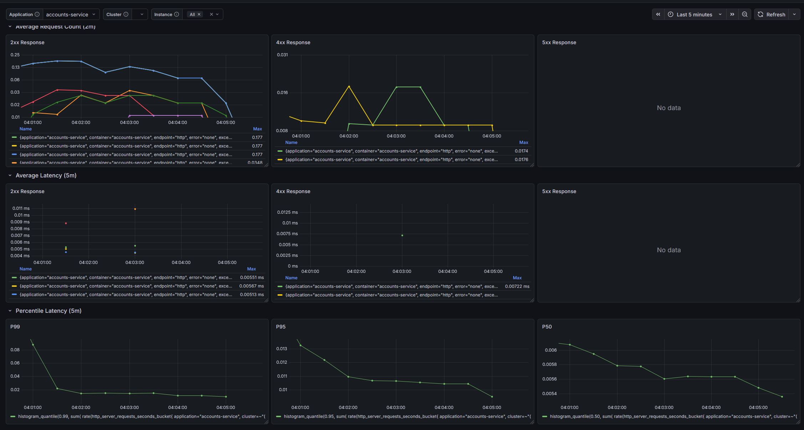
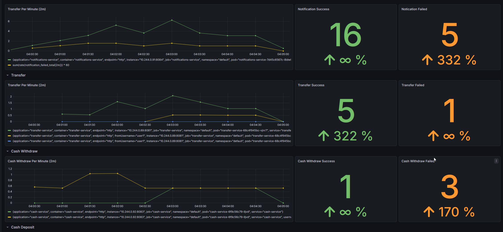
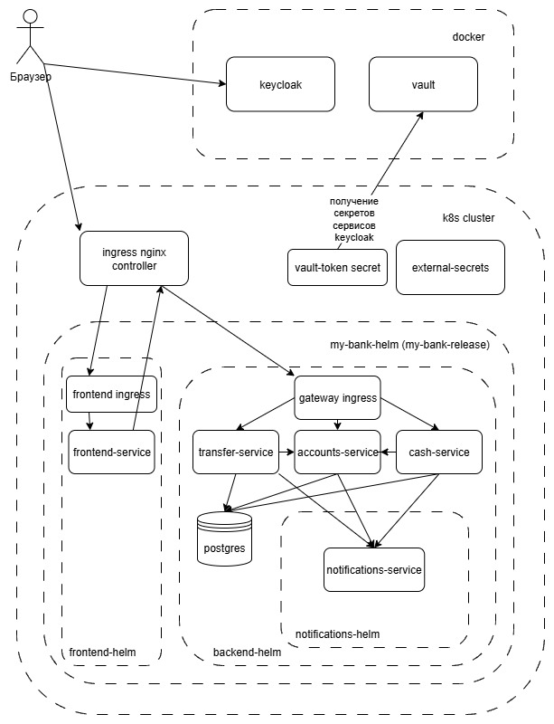

# practicum: Микросервисное приложение Мой Банк (my-bank)

### Состав:
- `my-bank-frontend`: Единое фронтенд приложение на основе WebMVC
- `my-bank-accounts`: Сервис хранения и выполнения операций над счетами пользователя
- `my-bank-cash`: Сервис обработки операций с наличными
- `my-bank-transfer`: Сервис обработки операций с переводами между пользователями
- `my-bank-notifications`: Сервис отправки уведомлений об осуществлении операций пользователям
- `bank-keycloak`: Единый сервис авторизации
- `vault`: Сервис хранения секретов

### Требования:
- jdk 21
- docker engine
- k8s
- helm

### Запуск тестов со сборкой jar:
- Запустить `docker engine`
- Выполнить `mvn clean install`

### Запуск приложения:
- В `hosts` вашей ОС добавить записи: `127.0.0.1 auth-local`, `127.0.0.1 grafana-local`
- Выполнить `mvn clean package`
- Запустить `docker engine`
- Выполнить `docker-build.sh`
- Выполнить `docker compose up -d`
- Выполнить `helm-common-install.sh` (взаимодействие с keycloak, создание ingress-nginx контроллера, поднятие kafka, prometheus-stack)
- Выполнить `helm dependency build ./my-bank-chart/charts/backend-chart`
- Выполнить `helm dependency build ./my-bank-chart`
- Выполнить `helm lint ./my-bank-chart` для валидации конфигурации
- Выполнить `helm upgrade --install --dry-run my-bank-release ./my-bank-chart` для валидации в K8s api
- Выполнить `helm upgrade --install my-bank-release ./my-bank-chart`
- Выполнить `helm test my-bank-release` для тестирования сервисов
- После успешной сборки и запуска приложение будет доступно по адресу `http://localhost`

### Мониторинг:
- Трейсинг:
  - Сервис Zipkin развернут по адресу по адресу http://localhost:9411. Ведется сквозная трассировка от frontend-service до notifications-service
- Метрики:
  - Метрики собираются инструментом Prometheus, настроены дашборды для отображения в Grafana (находятся в ./prometheus/dashbords):
    - Spring Boot 3.x Statistic - стандартный дашборд основной технической информации
    - Spring Boot Http (3.x) - стандартный дашборд графиков RPS запросов и задержек, расширенный персентилями таймингов
    - Business - собственный дашборд бизнес-метрик приложения
  - Алерты:
    - Бизнес: алерт превышения допустимого количество ошибок при отправке уведомлений
    - Инфраструктурные: недоступность сервисов и пороговое значение HEAP-памяти

Скриншоты

### Тестовые пользователи (login / pass):
- `user1` / `user1` - Сергеев Иван
- `user2` / `user2` - Иванов Сергей
- `user3` / `user3` - Семенов Василий

### Преднастроенные роли и права пользователей и сервисов:
- Пользователи:
  - `USER`
    - `accounts.read`
    - `accounts.write`
    - `transfer.read`
    - `transfer.write`
    - `cash.write`
- `accounts-service`:
  - `SERVICE`
    - `notifications.write`
  - `realm-management`
- `transfer-service`:
    - `SERVICE`
        - `notifications.write`
    - `accounts.read`
    - `accounts.write`
- `cash-service`:
    - `SERVICE`
        - `notifications.write`
    - `accounts.read`
    - `accounts.write`

### Состав helm-чартов и схема взаимодействия сервисов:

- `my-bank-chart`: основной umbrella-чарт со вспомогательными сервисами и секретами
    - `frontend-chart`: чарт сервиса фронденда, содержащий сам сервис и ingress для внешнего доступа из вне кластера
    - `backend-chart`: чарт сервисов бэкенда (accounts-service, transfer-service, cash-service) и их базы данных
      postgresql. K8s ресурсы сервисов созданы с помощью Range цикла так как являются типовыми. Так же содержит
      gateway-ingress для доступа к сервисам через единый домен gateway кластера и задачу создания очереди уведомлений 
      (notifications) в kafka.
        - `notifications-chart`: чарт сервиса уведомлений, который является сабчартом общего backend-чарта

